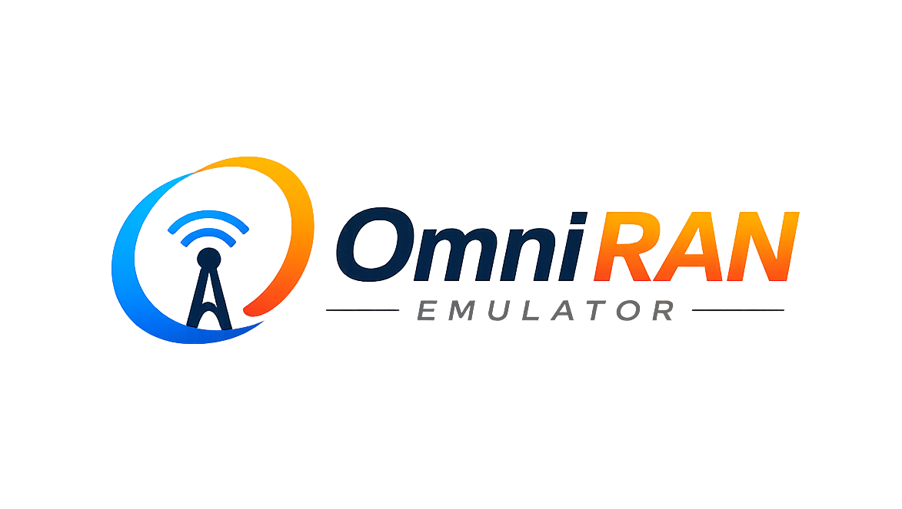

# OmniRAN Emulator

<p align="center">
  
</p>

OmniRAN Emulator is a unified, high-performance 5G network emulation solution that simulates real-world User Equipment (UE) and next-generation NodeB (gNB) behavior. It streamlines 5G core validation by delivering an affordable, scalable, and highly accurate virtual RAN environment for next-generation telecommunication testing.

*Note: OmniRAN Emulator borrows libraries and data structures from the [free5gc project](https://github.com/free5gc/free5gc) and builds upon previous open-source solutions.*

---

## 🚀 Key Modernizations & Optimizations

We have modernized and optimized the emulator to support modern Linux and compilation environments (including Ubuntu 22.04, 24.04, and 26.04 LTS):

1. **Pure Go Workloads**: Removed Cgo and GNU Scientific Library (`gsl`) dependencies from mathematical distribution generators. Workloads are now generated in pure, high-performance Go, removing the requirement to install `libgsl-dev` on target machines.
2. **Modern Go standard**: Upgraded the module engine to Go 1.22+, utilizing Go modules natively and ensuring compatibility with modern compilers.
3. **Dynamic Configuration Loading**: Added support for custom configuration files using the global CLI flag `-c` / `--config` (e.g. `./app -c custom_config.yml ue`).
4. **Ultra-lightweight Docker Packaging**: Redesigned the Docker build process using a multi-stage `golang:1.22-bookworm` builder and an `ubuntu:noble` (24.04) runner. By stripping the Go compiler SDK from the runtime image, the final container size has been reduced from **~850MB to just 95.8MB (an 88%+ reduction)**.
5. **Developer Makefile**: Added a root `Makefile` that automatically detects system-wide Go installations, falls back to a workspace Go SDK if missing, and provides clean container management targets.
6. **Advanced 5G Core Emulation**: Integrated TCP Radio Link Simulation (RLS) socket communication, sequential/concurrent multiple PDU sessions (up to 15 concurrent sessions per UE), dual-stack IPv4v6 PDU interface, and advanced NAS signaling procedures (Paging response via Service Request, and Network-initiated De-registration cleanup).
7. **Decoupled Architecture CLI Flags**: Supported standalone UE deployment command flags for separated machine/container testing scenarios.

---

## 🛠️ Prerequisites & Host Requirements

Because the emulator simulates network attachments and routes user plane traffic, it interacts directly with the Linux kernel network stack. Ensure the following modules are loaded on your host machine:

```bash
# Load SCTP module for NGAP control plane
sudo modprobe sctp

# Load IPIP module for virtual user-plane tunneling
sudo modprobe ipip
```

If running via Docker, the container must run in privileged mode (which is pre-configured in the `docker-compose.yml`).

---

## 📦 How to Build

### 1. Local Compilation
You do not need Go installed on your system. The Makefile will automatically download a local Go SDK inside the workspace if `go` is missing from your PATH:
```bash
make build
```
This generates the standalone compiled binary `app` at the root of the project.

### 2. Docker Image Build
To build the optimized Docker container:
```bash
make docker-build
```
This compiles the application in a cached builder stage and packages a minimal runtime image tagged as `omniran-emulator:latest`.

---

## 📖 Functionalities & CLI Usage

### Global Options
- `-c, --config <file_path>`: Path to configuration YAML (defaults to `config/config.yml`).
- `-h, --help`: Show help instructions.

### Commands

#### 1. `ue`
Test a single UE registration, authentication, security mode, and PDU session attachment procedure with the 5G Core. Creates a virtual `uetun1` interface.
- `--ue-only`: Run only the UE (do not start gNodeB in this process; GNodeB must be running).
```bash
./app ue
# Standalone decoupled mode
./app ue --ue-only
# Or with a custom configuration file
./app -c config/alternative.yml ue
```

#### 2. `gnb`
Initialize and establish an SCTP connection (NGAP) and GTP-U tunnel (N3) with the AMF/UPF, simulating a running gNodeB cell.
```bash
./app gnb
```

#### 3. `load-test`
Stress test the AMF by firing concurrent/queued registration requests for multiple simulated UEs.
- `-n, --number-of-ues`: Number of UEs to simulate (default: 1).
- `--ue-only`: Run only the UEs (do not start gNodeB in this process).
```bash
./app load-test -n 50
# Decoupled load testing
./app load-test -n 50 --ue-only
```

#### 4. `amf-load-loop`
Send requests periodically to stress test AMF responsiveness over time.
- `-n, --number-of-requests`: Number of requests to send per second (default: 1).
- `-t, --time`: Duration of the test in seconds (default: 1).
```bash
./app amf-load-loop -n 20 -t 30
```

#### 5. `ue-latency-interval`
Measure and print the average registration latency of UEs in milliseconds.
- `-n, --number-of-requests`: Total queue size of UEs to evaluate (default: 1).
```bash
./app ue-latency-interval -n 10
```

#### 6. `amf-availability`
Perform reachability and uptime tests on the AMF over a specified time window.
- `-t, --time`: Duration of the test in seconds (default: 1).
```bash
./app amf-availability -t 60
```

---

## 🐳 Running in Docker Compose

Docker Compose coordinates the emulator with your pre-existing Docker-based 5G Core network. 

1. Ensure the core network is active and uses a shared network (default `docker_privnet`).
2. Launch the emulator using:
```bash
make docker-up
```
3. Control plane parameters and IP addresses can be configured directly through environment variables in `docker/docker-compose.yml`.
4. Tear down the container with:
```bash
make docker-down
```

---

## 🔧 Advanced Features Config & Usage

### 1. TCP Radio Link Simulation (RLS)
By default, the UE communicates with GNodeB via local UNIX sockets (`/tmp/gnb.sock`). To run them on separate hosts or network namespaces, configure:
- **gNodeB Config (`config/config.yml`)**:
  ```yaml
  gnodeb:
    link_type: "tcp"
    link_port: 9488
  ```
- **UE Config (`config/config.yml`)**:
  ```yaml
  gnodeb:
    link_type: "tcp"
    link_port: 9488
    controlif:
      ip: "<IP of remote gNodeB>"
  ```

### 2. Multi-PDU & Dual-Stack Sessions
Configure concurrent PDU sessions under the `ue.pdusessions` list:
```yaml
ue:
  pdusessiontype: "IPv4v6"
  pdusessions:
    - id: 1
      dnn: "internet"
      pdusessiontype: "IPv4v6"
    - id: 2
      dnn: "ims"
      pdusessiontype: "IPv6"
```
On session establishment, separate TUN interfaces (`uetun1`, `uetun2`) will be dynamically configured with policy routing tables and source routing rules matching their respective session IDs.

